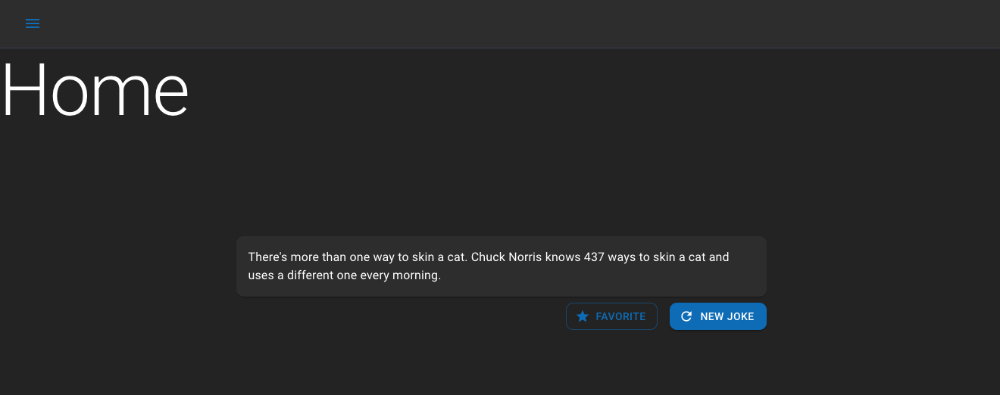

# material-ui-recoil-template
A ready to use boilerplate for starting [experimental] react projects

Initialized with [Create-React-App](https://reactjs.org/docs/create-a-new-react-app.html) flavored with:
* [Material-UI](https://github.com/mui-org/material-ui) Components
* [recoil](https://github.com/facebookexperimental/Recoil) State Management
* [react-typesafe-routes](https://github.com/innFactory/react-typesafe-routes) Routing

# Chucknorris Challenge

- Dieses Template dient als Basis für ein paar Aufgaben
- Im Template befindet sich bereits alles was man so braucht
- Als Beispiel wurde die https://api.chucknorris.io/ API angebunden, es wird immer ein zufälliger Witz geladen

## 1. Challenge: Template
### 1.1. Template auschecken

- Installiere dir [Github-Desktop](https://desktop.github.com/)
- Melde dich dort mit deinem Github-Account an
- Falls du noch keinen Account hast, kannst du dir einfach auf https://github.com/ einen erstellen
- Nun gehe auf https://github.com/innFactory/material-ui-recoil-template und unter dem grünen "Clone" Button findest du die Funktion "Open with Github Desktop". Alternativ kannst du das Repo auch direkt in Github Desktop oder mit Git clonen

### 1.2. Node installieren
- Gehe auf https://nodejs.org/en/download/ und installiere dir Nodejs
- Damit hast du den Packet-Manager NPM
- Lies dir durch, für was NPM so gut ist: https://docs.npmjs.com/about-npm

### 1.3. Template starten
- Gehe mit dem Terminal in deinem Ordner, in dem du das Template gecloned hast z.B. `Documents/Github/material-ui-recoil-template`
- nun installiere zunächst die Dependencies mit: `npm install`
- danach kannst du das Webprojekt starten mit: `npm start`

### 1.4. Template im Browser aufrufen
- nun kannst du unter http://localhost:3000 die WebApp anschauen
- müsste so aussehen, wie im Screenshot
  

### 1.5. Code öffnen mit VS Code
- Nun schauen uns wir den SourceCode von der WebApp an
- Installiere dir hierfür [VS-Code](https://code.visualstudio.com/)
- Öffne in VS-Code den geklonten Ordner /material-ui-recoil-template

### 1.6. Erste Änderung
- Öffne in dem Projekt, dass du in VSCode offen hast das File `HomePage.tsx`
- Ändere die Überschrift "Home" zu irgendwas anderem
- Nun müsstest du instant die Änderungen im Browser sehen
- Falls nicht, gehe in ein Terminal und führe in deinem Projektordner `npm start` aus

## 2. Challenge: Hintergrundwissen

### 2.1 Was ist React?
- Beschäftige dich mit der Doku von React: https://reactjs.org/
- Du solltest danach folgendes wissen:
  * Was ist JSX? 
  * Was ist eine StatefulComponent?
  * Was sind Props?
  * Was sind Hooks?
- natürlich kannst du neben der offiziellen Doku auch viele andere Quellen nutzen

### 2.2 Komponenten Library Material-UI
- Material-UI ist ein Design von Google
- Dieses Design wurde von einem Typen namens 
Olivier Tassinari in React nach implementiert
- Dadurch können wir diese OpenSource Komponenten nutzen und müssen nicht jeden Button etc. neu erfinden, sondern können direkt auf etliche fertige und ziemlich schöne Komponenten zugreifen
- diese kann man sich hier anschauen: https://next.material-ui.com/
- Du kannst ruhig mal alle durchklicken, um ein Gefühl dafür zu bekommen

### 2.3 Typescript
- Wir nutzen statt Javascript eine sehr ähnliche "Variante" und zwar [Typescript](https://www.typescriptlang.org/)
- Lies dir mal die erste Seite der Doku durch
- Du solltest nach einer (längeren) Recherche folgendes Wissen:
  * Was ist eine typisierte Sprache?
  * Welche typisierten Sprachen gibt es noch?
  * Welche untypisierten Sprachen gibt es noch?
  * Welche Vorteile hat Typescript?
  * Wie sehr unterscheidet sich Typescript von Javascript?
  * Kann ein Browser Typescript interpretieren? Bzw. kann Typescript direkt im Browser ausgeführt werden?

## 3. Challenge: Styling

### 3.1 CSS
- Das Styling im Web basiert letztendlich immer auf CSS
- Was CSS ist kannst dir z.B. [hier](https://developer.mozilla.org/de/docs/Learn/Getting_started_with_the_web/CSS_basics) anschauen
- Mit der Material-UI Library kommen ein paar Erleichterungen mit, sodass man z.B. CSS direkt im Typescript-File schreiben kann: https://next.material-ui.com/styles/basics/
  
### 3.2 Eine coole 404 Seite gestalten
- Gehe in das File `NotFoundPage.tsx`
- Diese Seite wird immer angezeigt, falls die Route nicht existiert. z.B. wenn du http://localhost:3000/asdf aufrufst
- Die Seite ist nicht besonders schick, darum würde ihr ein Redesign gut stehen
- Es gibt ein paar 404 Seiten, die den Benutzer auf eine "nettere" Art sagen, dass die Seite nicht gefunden wurde hier ein paar Beispiele:
  * https://www.amazon.de/asdf
  * https://laura.vb-rb-baufinanzierung.de/asdf
  * https://9gag.com/asdf
  * https://www.netflix.com/asdf

## 4. Challenge: Favoriten

- Wenn man im Template einen Witz gut findet, soll man ihn zu seinen Favoriten hinzufügen können
- Dazu gibt es bereits eine Seite, auf der eine Liste später angezeigt werden kann: `FavoritesPage.tsx`
- Ziel: Liste anzeigen mit Favoriten
### 4.1 Globales State Management
- Jede Component kann ihren eigenen State haben. Der State kann in Form von Props auch an den Kindern übergeben werden. Muss aber der State von einem Ast auf den nächsten wird diese Methode schnell aufwendig und unübersichtlich. Darum brauchen wir für manche Daten ein "globales Statemanagement"
- In diesen Template verwenden wir hierfür [recoil](https://recoiljs.org/)
- Da gibt's ein gutes Video, indem die Funktionsweise erklärt wird: https://youtu.be/_ISAA_Jt9kI
- Der aktuelle Chucknorris Witz auf der HomePage wird in einem solchen "globalen State" gehalten, damit mehrere Komponenten problemlos darauf zugreifen können und diesen ggf. verändern können. Dies findest du im Ordner `src/state`
- Der Witze selbst kommen von der Chucknorris API. Der Request ist getrennt vom State und befindet sich im Ordner `/api`
  

### 4.2 Favoriten im State
- Nun brauchen wir eine Liste mit Jokes als Favoriten im State
- Immer wenn man auf den Stern-Button auf der HomePage drückt, soll der entsprechende Witz zu dieser Liste hinzugefügt werden
- Die Liste wird dann in der FavoritesPage gelesen und angezeigt
- Dafür brauchen wir keine Request in /api und damit auch keine selector. Recoil-Atoms werden vollkommen ausreichen.
- Als Beispiel kann man sich anschauen, wie ein einfacher Boolean-Wert gehalten wird, wie z.B. der drawerOpenState

## 5. Challenge: Random Cat

Neben Chucknorris Witzen wäre das Prinzip auch für Katzen Fotos cool. Dazu gibt es auch eine public API: https://cataas.com/cat mit folgendem Queryparameter bekommt man ein JSON zurück:
 https://cataas.com/cat?json=true

### 5.1 Neue Seite mit zufälligem Katzenbild
- Lege eine neue Seite in `/pages` an, die zufällige Katzenbilder laden kann
- Im `/model` brauchen wir einen Datentyp `CatPic`, der das JSON von  https://cataas.com/cat?json=true abbilden kann
- Zusätzlich brauchen wir auch wieder einen State ähnlich, wie der `currentJokeState`

### 5.2 Favorisierte Katzen
- Auf der existierenden `FavoritesPage.tsx` soll es einen Tab (oder irgendwas ähnliches geben), damit man auch Katzenbilder-Favoriten sehen kann
- Ähnlich wie in Challenge 4 brauchen wir hier auch wieder eine State Liste mit Katzenbildern

## 6. Challenge: Eigene Witze
- Neben den Witzen von Chucknorris, wäre es ganz gut, wenn man auch eigene Witze über ein Textfeld eingeben könnte
- Diese können entweder gleich zu den Favoriten, oder auch in einen separaten State gespeichert werden
- Die eignen Witze können auch in der Favoriten-Liste angezeigt werden, sollen aber gekennzeichnet sein, bzw. sich durch z.b. ein Icon unterscheiden